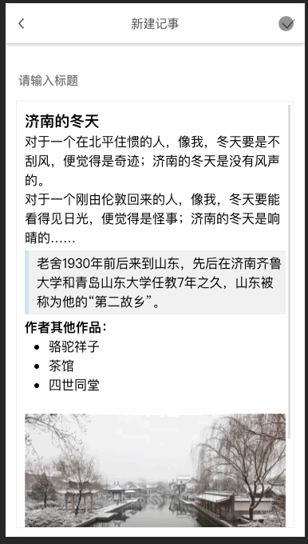

## 移动端富文本编辑器
基于[wangEditor-mobile](https://github.com/wangfupeng1988/wangEditor-mobile), 使用 React Hooks + styled-component + typescript + localStorage 构建一个富文本记事本 🚀

### 😀 preview


### ✨ Features
- 对移动端更加友好的富文本编辑，包括
  - 设置标题
  - 加粗
  - 设置字体颜色
  - 引用
  - 列表
  - emoji
  - 代办
- 本地存储
- 列表展示

### 📦 quick start

```
git clone git@github.com:revanli/notepad.git
cd notepad
yarn install
yarn dev
```

